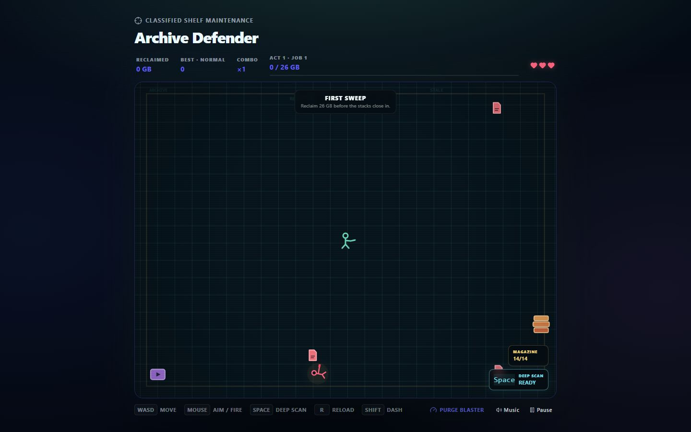

<div align="center">
  <h1>Archive Defender</h1>
  <p>Reclaim your library. Defend every byte.</p>
  <h3><a href="https://brycepearce.github.io/archive-defender/">▶ Play Archive Defender</a></h3>
  <p><a href="https://www.npmjs.com/package/archive-defender">View the package on npm</a></p>
  
</div>

Archive Defender is a twin-stick arcade game about stale media, runaway duplicates, and hostile
sessions. It began as the hidden arcade inside
[Plex Librarian](https://github.com/BrycePearce/plex-librarian) and is also available as an
embeddable React package.

## Controls

- `WASD` or arrow keys to move; mouse to aim and fire.
- `Shift` to dash, `Space` for Deep Scan, `R` to reload, and `Escape` to pause.
- Touch controls are available on touch-capable devices.

## Development

Archive Defender uses Deno 2, React, and Vite.

```bash
deno task verify
```

## License

Source code is available under the [MIT License](LICENSE). Music and sound-effect credits are listed
in [`src/game/assets/README.md`](src/game/assets/README.md).
